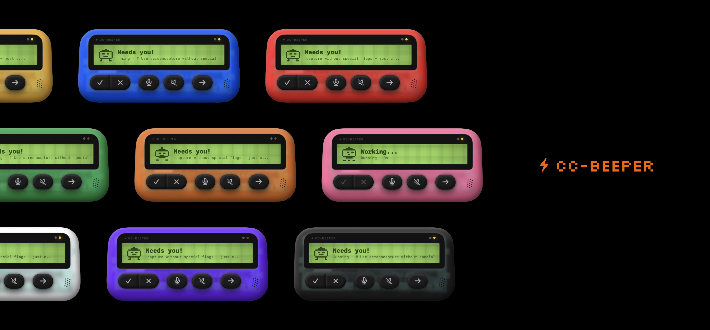

<p align="center">
  
</p>

# CC-Beeper

<p align="center">
  A desktop companion for Claude Code. See what Claude is doing. Talk back.
</p>

<p align="center">
  
  
  
</p>

---

## Install

```bash
git clone https://github.com/vecartier/cc-beeper.git
cd cc-beeper
make install
```

`make install` builds the app, installs the Claude Code hooks, and launches CC-Beeper. Requires Swift (via Xcode Command Line Tools).

---

## What is CC-Beeper?

CC-Beeper is a floating macOS widget that lives on your desktop like a retro pager — updating its LCD display in real time as Claude Code works across your sessions. No tab-switching. No terminal watching. Just a glanceable companion that tells you what Claude is doing and lets you respond instantly.

| State | What it means |
|-------|--------------|
| **THINKING** | Claude is working — tool calls, file edits, reasoning in progress |
| **DONE** | Claude finished. Your next message is waiting. |
| **NEEDS YOU** | Claude needs permission to run a tool. Approve or deny from the widget. |

---

## Features

<table>
<tr>
<td align="center"><strong>Monitor</strong></td>
<td align="center"><strong>Voice</strong></td>
<td align="center"><strong>Permissions</strong></td>
<td align="center"><strong>Themes</strong></td>
</tr>
<tr>
<td>Floating LCD pager shows Claude's live state across all sessions — no terminal watching required</td>
<td>Press Speak, dictate your message, CC-Beeper injects it directly into Claude Code</td>
<td>Approve or deny file writes, shell commands, and network calls without touching the terminal</td>
<td>10 color shells: black, blue, green, mint, orange, pink, purple, red, white, yellow</td>
</tr>
</table>

- **YOLO mode** — auto-approve all tool requests (YOLO badge on LCD when active)
- **Vibration alerts** — haptic-style window shake when Claude needs your attention
- **Global hotkeys** — control CC-Beeper without switching focus
- **Auto-speak** — CC-Beeper reads Claude's summaries aloud when it finishes working

---

## Shell Themes

10 color shells — black, blue, green, mint, orange, pink, purple, red, white, yellow. Full dark mode support.

---

## How it works

CC-Beeper uses Claude Code's [hooks system](https://docs.anthropic.com/en/docs/claude-code/hooks) to monitor sessions. A lightweight Python hook receives events from Claude Code and writes them to a shared IPC directory. The macOS app watches those files and updates instantly.

```
Claude Code  ──►  Hook (Python)  ──►  ~/.claude/cc-beeper/events.jsonl  ──►  CC-Beeper.app
                       │                                                        │
                  Permission? ───►  ~/.claude/cc-beeper/pending.json  ─────────►  Show NEEDS YOU
                       ▲                                                        │
                       └────────  ~/.claude/cc-beeper/response.json  ◄─────────┘
```

---

## Requirements

- macOS 14 or later
- [Claude Code](https://docs.anthropic.com/en/docs/claude-code) CLI installed
- (Optional) Groq API key for higher-quality voice transcription
- (Optional) OpenAI API key for AI-powered text-to-speech

---

## Important disclaimer

> CC-Beeper lets you approve or deny Claude Code tool requests directly from the widget. **You are responsible for reviewing what you approve.** Clicking "Allow" grants Claude Code permission to execute the requested action on your machine.
>
> **YOLO mode** automatically approves every permission request without prompting. When enabled, Claude Code will execute all tool calls — including file modifications, shell commands, and network requests — without asking for confirmation. **Use YOLO mode at your own risk.**
>
> The authors are not liable for any damage, data loss, or unintended consequences. By using CC-Beeper, you accept these risks.

---

## Contributing

Contributions are welcome.

1. Fork the repo and create a feature branch
2. CC-Beeper is a Swift Package — open `Package.swift` in Xcode or build with `make build`
3. Submit a pull request with a clear description

CC-Beeper uses Claude Code's hooks system. See the [Hooks docs](https://docs.anthropic.com/en/docs/claude-code/hooks) for how the IPC layer works.

- **Bug reports:** open a GitHub issue
- **Feature requests:** open a GitHub discussion

---

## License

MIT — see [LICENSE](LICENSE)
