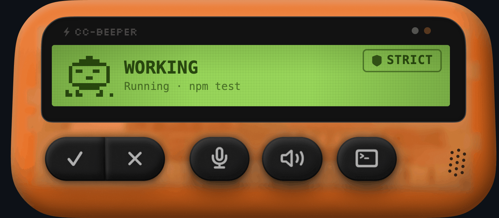
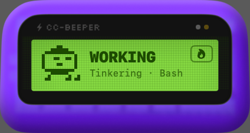
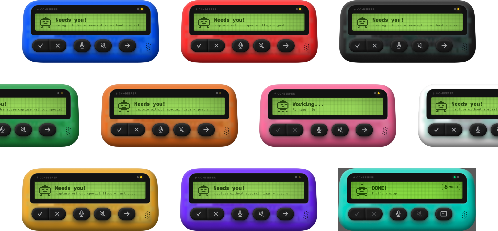

# CC-Beeper

**A retro pager companion for [Claude Code](https://docs.anthropic.com/en/docs/claude-code) on macOS.**

Never miss a permission request, task completion, or error again — even when Claude Code is buried under 30 tabs.

---

## What is this?

CC-Beeper is a tiny macOS widget that sits on your desktop (or hides in the menu bar) and stays connected to Claude Code via HTTP hooks. It shows you what Claude is doing in real time on a retro pixel-art LCD screen, plays sounds when it needs your attention, and lets you approve or deny permissions with a hotkey — no terminal switching required.

Think of it as a pager for your AI coding assistant. It beeps, it buzzes, it shows a little pixel character doing the work. And when Claude Code needs you, you'll know.

---

## Launch Video

https://github.com/user-attachments/assets/d65f557b-1b5e-41f9-b9fe-9826897f9140

---

## Why CC-Beeper?

If you use Claude Code, you know the friction: you kick off a task, switch to something else, and miss a permission prompt that blocks the entire run. Or you don't realize a task finished 10 minutes ago. CC-Beeper solves this with:

- **Ambient awareness** — a glanceable widget that shows Claude Code's state at all times
- **Instant action** — approve or deny permissions via global hotkeys (⌥A / ⌥D) from any app
- **Voice I/O** — dictate prompts into the terminal with on-device Whisper STT, and have Claude read results back via Kokoro TTS
- **Permission presets** — from paranoid Strict mode to full-send YOLO, with two steps in between
- **Personality** — 14x12 pixel-art characters with unique animations per state. In YOLO mode, the character swaps to a rabbit.

---

## Features

### LCD States

CC-Beeper's screen shows 8 distinct states, each with its own animation, subtitle pool, and priority level:

| State | | What's happening |
|-------|-------|-----------------|
| **SNOOZING** |  | No Claude Code session active for 60s. The character sleeps. |
| **WORKING** |  | Claude is running a tool. Shows what it's doing: *Busy with bash*, *Tinkering with write*... |
| **DONE!** |  | Task completed successfully. Blinks 10x, then fades to idle after 3 min. |
| **ERROR** |  | Task failed. Glitch entrance followed by a face meltdown animation. |
| **ALLOW?** |  | Claude needs a permission you haven't auto-approved. Press ⌥A to approve, ⌥D to deny. |
| **LISTENING** |  | Voice recording active — you're dictating a prompt via microphone. |
| **RECAP** |  | TTS is reading Claude's last response aloud. |

Every state transition triggers a bounce — the character hops 4px up and snaps back in 0.25s. Subtitles are randomly picked from each pool on every change.

States follow a strict priority order so you never miss what matters: Error > Allow? > Input? > Listening > Recap > Working > Done > Snoozing.

<!-- State animation GIFs placeholder -->
<!--  -->

### Permission Spectrum

Four presets that control how much CC-Beeper auto-approves on your behalf:

| Preset | What it auto-approves | Badge |
|--------|----------------------|-------|
| **Strict** | Nothing. Every tool needs manual approval. | STRICT |
| **Relaxed** | Read, Glob, Grep | RELAXED |
| **Cautious** | Read, Glob, Grep, Write, Edit, NotebookEdit | CAUTIOUS |
| **YOLO** | Everything. Claude Code bypasses all permissions. | YOLO |

In non-YOLO modes, CC-Beeper intercepts `PermissionRequest` hooks, checks the tool against the allowlist, and sends an auto-approve response. In YOLO mode, Claude Code itself handles the bypass — and the LCD character swaps to a rabbit.

<!-- Permission preset picker screenshot placeholder -->
<!--  -->

### Voice Record (STT)

Dictate prompts into Claude Code without touching the keyboard.

- **On-device transcription** via WhisperKit (99 languages) with Apple SFSpeech as fallback
- Choose between small (~2GB) or medium (~5GB) Whisper models
- Records raw audio, converts to 16kHz mono PCM, batch transcribes on stop
- Injects text directly into the focused terminal via `CGEvent` keyboard simulation (supports Terminal.app, iTerm2, Warp, Alacritty, Kitty, WezTerm)
- Texts over 200 characters use clipboard paste instead for reliability
- Automatically presses Enter after injection
- Toggle with **⌥R** from anywhere

### Voice Reader (TTS)

Have Claude read its responses aloud when a task finishes.

- **Primary engine:** Kokoro — runs as a Python subprocess, communicates via stdin/stdout + WAV file watcher
- **Fallback:** Apple AVSpeechSynthesizer
- Triggers automatically on task completion when "Read Over" is enabled
- **9 languages**, 39 voices (20 female + 19 male): English US, English UK, Spanish, French, Hindi, Italian, Japanese, Portuguese, Chinese
- A single language preference drives both the STT hint and TTS voice selection

### Widget Sizes

Three modes depending on how much screen real estate you want to give it:

- **Large** — full beeper with LCD + buttons (approve, deny, record, sound, terminal)
- **Compact** — LCD only, interact via hotkeys
- **Menu Only** — no widget on screen, just the menu bar icon

 

The menu bar icon is always visible in all modes.

### Themes

10 shell colors, each with a dark mode LCD variant.

### Global Hotkeys

All hotkeys work from any app, in any keyboard layout (AZERTY, QWERTZ, Dvorak).

| Hotkey | Action | What it does |
|--------|--------|-------------|
| **⌥A** | Accept | Approve pending permission |
| **⌥D** | Deny | Reject pending permission |
| **⌥R** | Record | Toggle voice recording |
| **⌥T** | Terminal | Focus the active terminal app |
| **⌥M** | Mute | Stop TTS / trigger summary replay |

Implemented via Carbon HotKey API — events are consumed and don't leak to the focused app. All hotkeys are remappable in Settings.

### Sound & Haptics

- **Ping** on permission/input requests
- **Pop** chime on task completion (non-YOLO mode)
- **Vibration:** 60 shakes over 3s on done; immediate shake + 15s repeat on permission/input until resolved
- Click the beeper to cancel vibration

---

## Getting Started

### Requirements

- macOS 26 or later
- [Claude Code](https://docs.anthropic.com/en/docs/claude-code) CLI installed (`~/.claude/` must exist)

### Installation

<!-- Update with actual download link when available -->

1. Download the latest release from [Releases](https://github.com/vecartier/cc-beeper/releases)
2. Move `CC-Beeper.app` to `/Applications`
3. Launch — the onboarding flow will guide you through everything:

### Onboarding (6 steps)

1. **Welcome** — What CC-Beeper is and does
2. **CLI Detection** — Checks for `~/.claude/`, installs HTTP hooks automatically
3. **Permissions** — Grants Accessibility, Microphone, and Speech Recognition (polls every 2s)
4. **Model Download** — Downloads WhisperKit + Kokoro models with a progress bar
5. **Language** — Pick from 9 languages (auto-detects your system locale)
6. **Done** — Opens the main widget, ready to go

---

## Settings

CC-Beeper has 8 settings tabs:

| Tab | What's inside |
|-----|--------------|
| **Theme** | 10 color picker + dark mode toggle |
| **Voice Record** | Whisper model size (small/medium), download button |
| **Read Over** | Auto-speak toggle, Kokoro/Apple picker, language & voice selection |
| **Feedback** | Sound + vibration toggles |
| **Hotkeys** | 5 remappable hotkey fields |
| **Permissions** | 4 preset radio buttons |
| **Setup** | Reinstall hooks, reopen onboarding |
| **About** | Version, credits, links |

---

## Privacy

CC-Beeper is fully local. Nothing leaves your machine.

- **No network calls** — CC-Beeper never contacts any external server. All communication happens over `127.0.0.1` between Claude Code's hooks and CC-Beeper's local HTTP server.
- **No telemetry, no analytics, no crash reporting** — zero outbound connections.
- **On-device speech** — WhisperKit (STT) and Kokoro (TTS) both run locally. Your voice data is never uploaded anywhere.
- **No accounts** — no sign-up, no login, no tokens stored.
- **Hooks are transparent** — the 6 entries added to `~/.claude/settings.json` are plain `curl` commands to `localhost`. Inspect or remove them anytime.
- **Port file only** — the only file CC-Beeper writes outside the app sandbox is `~/.claude/cc-beeper/port` (a single integer), so other tools know where to reach it.
- **Permissions are minimal** — Accessibility (for global hotkeys), Microphone (for dictation), Speech Recognition (fallback STT). None are required; the app works without them.

---

## Technical Details

<strong>How the hooks work</strong>

CC-Beeper communicates with Claude Code via HTTP hooks. On launch, it binds to a local port (trying 19222-19230) and registers hook scripts in `~/.claude/settings.json`. When Claude Code fires lifecycle events — `PreToolUse`, `Stop`, `StopFailure`, permission prompts, notifications — the hooks send HTTP requests to CC-Beeper's local server.

Commands containing `cc-beeper/port` are recognized as CC-Beeper hooks for safe update/removal.

<strong>Session management</strong>

CC-Beeper tracks multiple concurrent Claude Code sessions via a `sessionStates` dictionary. The displayed state resolves by priority across all active sessions. Sessions auto-prune after 2 hours of inactivity.

<strong>Instance detection</strong>

On launch, CC-Beeper pings ports 19222-19230 via HTTP to detect if another instance is already running, preventing conflicts.

<strong>Menu bar states</strong>

The menu bar icon reflects the current state: normal (outline), attention (orange), YOLO (purple), recording (circle+stop), speaking (speaker+waves), or hidden (dimmed).

The menu contains: session count, state label, Sleep/Wake toggle, permission preset picker, size picker, hotkey shortcuts list, Settings, and Quit.

---

## Important disclaimer

> CC-Beeper lets you approve or deny Claude Code tool requests directly from the widget. **You are responsible for reviewing what you approve.** Clicking "Allow" grants Claude Code permission to execute the requested action on your machine.
>
> **YOLO mode** automatically approves every permission request without prompting. When enabled, Claude Code will execute all tool calls — including file modifications, shell commands, and network requests — without asking for confirmation. **Use YOLO mode at your own risk.**
>
> The authors are not liable for any damage, data loss, or unintended consequences. By using CC-Beeper, you accept these risks.

---

## Contributing

CC-Beeper is open source — contributions, ideas, and bug reports are welcome.

1. Fork the repo
2. Create a feature branch (`git checkout -b feature/your-idea`)
3. Commit your changes
4. Open a Pull Request

---

## License

GPL-3.0 — see [LICENSE](LICENSE) for details.

---

**Built by [Victor Cartier](https://github.com/vecartier)**

If CC-Beeper saves you from one missed permission prompt, give it a star.

